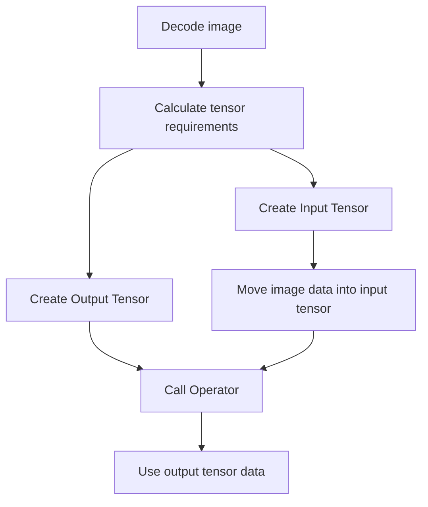

# Getting Started (C++)

This guide demonstrates the workflow for the rocCV C++ library through creating a tensor, moving image data into the tensor, running an operator asynchronously on a stream, and exporting the tensor data afterwards.

## General Workflow Overview


## 1. Creating Tensors
### 1.1) Calculating tensor requirements
Tensor requirements must be calculated before creating a tensor. This provides the information necessary to determine the data type, shape, and layout of said tensor. For simplicity, rocCV offers support for common image layouts.
```cpp
// Specify the number of images and the size of each image.
int numImages = 1;      // Number of images in the batch
int imageWidth = 720;   // Width for each image in the batch
int imageHeight = 480;  // Height for each image in the batch

roccv::ImageFormat inputFmt = roccv::FMT_RGB8;  // For 3-channel, 8-bit interleaved RGB images

// Calculate tensor requirements
roccv::Tensor::Requirements reqs = roccv::Tensor::CalcRequirements(numImages, {imageWidth, imageHeight}, inputFmt, eDeviceType::GPU);
```

> **Note**\
> Calculating tensor requirements using roccv::ImageFormat will typically specify a tensor with the layout type NHWC (Batch size, height, width, channels) to represent a batch of images. In this case, FMT_RGB8 specifies a tensor with layout NHWC, data type U8, and 3 channels.
>
> Although using the pre-defined ImageFormats covers most use cases, if desired, the shape, layout, and datatype of the tensor can be specified manually using overloads of `roccv::Tensor::CalcRequirements()`. Refer to the API reference for more information on this.

### 1.2) Creating input/output tensors
Using the calculated requirements, create input and output tensors as required for the operator.

Note that, for some operators (such as Resize), the output tensor size will not match that of the input tensor and will have to be calculated separately. In this case, we'll assume that both the input and output tensors are identical in layout, datatype, and size.
```cpp
// Create input/output tensors based on calculated requirements
roccv::Tensor input(reqs);
roccv::Tensor output(reqs);
```

### 1.3) Moving image data to the input tensor
Once image data has been loaded, it can be moved into the tensor via `hipMemcpy/hipMemcpyAsync` if on a GPU, or `memcpy` if on a CPU. Exporting `TensorData` provides access to the raw data of a tensor via `basePtr()`.

```cpp
unsigned char *imageData;
// Decode image into imageData using a preferred image decoding library.

// Export tensor data from the input tensor for accessing the raw data.
auto tensorData = input.exportData<roccv::TensorDataStrided>();

// Move decoded image data into the Tensor. In this case, the Tensor has been allocated on the GPU.
size_t imageSizeBytes = input.shape().size() * input.dtype().size();
hipMemcpy(tensorData.basePtr(), imageData, imageSizeBytes);
```

## 2. Calling Operators
Once input and output tensors have been created, they can be passed into an operator. Users must specify whether the operator is to be run on the device (`eDeviceType::GPU`) or the host (`eDeviceType::CPU`). If a device type is not specified, `eDeviceType::GPU` will be selected as the default.

```cpp
// Create a HIP stream for the operator.
hipStream_t stream;
hipStreamCreate(&stream);

// Specify operator parameters
int32_t flipCode = 0;   // Flip code 0 will flip the image along the X-axis.

// Create and call the flip operator on the newly created HIP stream with the GPU.
roccv::Flip flip;
flip(stream, input, output, flipCode, eDeviceType::GPU);
// Can also call the GPU version of the operator by default using: flip(stream, input, output, flipCode)

// Optionally, additional operators can be queued up on the same stream to create an image processing pipeline.

// Block until all work on the provided stream has been completed, and destroy the stream once finished.
hipStreamSynchronize(stream);
hipStreamDestroy(stream);
```

> **Note**\
> When using the CPU to call an operator, the operator will block until the operation has completed. When using the GPU to call an operator, the call is non-blocking and external synchronization with the HIP stream is required.

## 3. Exporting Tensor Data
Once the operator has finished, the results will be written to the output tensor. This output tensor can either be passed into another operator for further image processing, or moved back into host (CPU) memory.

```cpp
// Allocate memory on the host to move output data into
std::vector<unsigned char> outputHost(output.shape().size());

// Export output tensor data and move to host allocated memory
auto outputTensorData = output.exportData<roccv::TensorDataStrided>();
hipMemcpy(outputHost.data(), outputTensorData.basePtr(), output.shape().size() * output.dtype().size(), hipMemcpyDeviceToHost);
```

---
For more information, refer to the sample applications in [/samples](../samples).